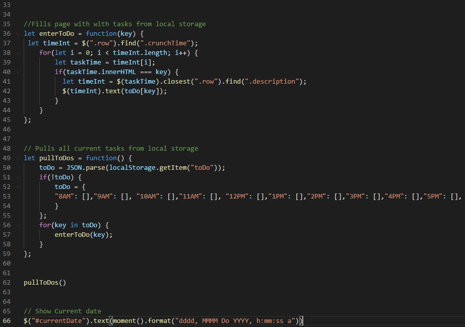

# Work-Day-Scheduler-2.0
  
## Description
A simple application that allows you to organize and optimize your work day by listing and saving to do items.

## Purpose
Many people today, be it a working professional or a gym rat, seek structure in their day to day activities. It's no wonder, structure imparts efficiency and efficiency breeds results. The Work Day Scheduler 2.0 does just that. No matter what the tasks at hand are, this application allows you to safely take note of and save your daily dues. Not only does this allow you to organize and plan your day, but it also dissolves the nagging thought of "Whats next?" from your mind, freeing you to think and perform at your maximum output. So whoever you are, if you seek to structure you day to its fullest potential and optimize everything you do, give Work Day Scheduler 2.0 a try.

## Table of Contents
- [Built With](#languages)
- [URL](#url)
- [Deployed Application Screenshot](#App)
- [Source Code Screenshot](#Code)
- [Contribution](#contributing)
- [Questions](#questions)

## Built With
* HTML
* CSS
* JavaScript

## URL
Visit the application [HERE](https://epc318.github.io/Work-Day-Scheduler-2.0/)

## Deployed Application Screenshot

## Source Code Screenshot

## Contributions
This project was made by Evan Carlson and contains references and material learned in the University of Minnesota Web Dev Bootcamp.

No Outside Contributions are being accepted at this time.

## Questions
If you have any questions on this project, feel free to reach me through my GitHub profile or email:
- [Evan Carlson](https://github.com/epc318), carl4917@umn.edu.

### ©️2022 Workday Warriors, Inc