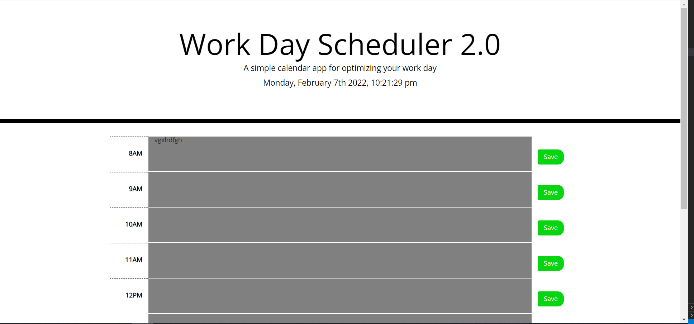

# Work-Day-Scheduler-2.0
  
## Description
A simple application that allows you to organize and optimize your work day by listing and saving to do items.

## Table of Contents
- [Built With](#languages)
- [URL](#url)
- [Deployed Application Screenshot](#App)
- [Contribution](#contributing)
- [Questions](#questions)

## Built With
* HTML
* CSS
* JavaScript

## URL
Visit the application [HERE](https://epc318.github.io/Work-Day-Scheduler-2.0/)

## Deployed Application Screenshot

## Contributions
This project was made by Evan Carlson and contains references and material learned in the University of Minnesota Web Dev Bootcamp.

No Outside Contributions are being accepted at this time.

## Questions
If you have any questions on this project, feel free to reach me through my GitHub profile or email:
- [Evan Carlson](https://github.com/epc318), carl4917@umn.edu.
